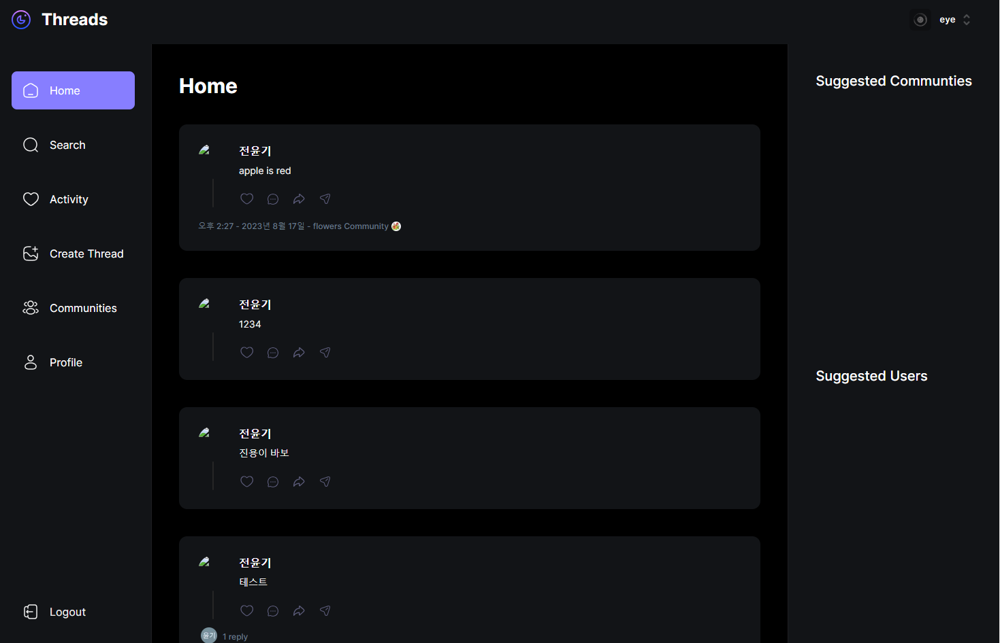

# NEXT-BLOG

NEXT.JS 13.4 버전으로 작성한 Thead 입니다.

******

📓 사용 스택
---

➡️ HTML: 웹 페이지의 구조를 정의하는 데 사용됩니다.  
➡️ tailWind CSS : Next.js와 조합하면 컴포넌트를 빠르게 스타일링하고 디자인 시스템을 구축할 수 있으며, 개발 생산성을 크게 향상시킵니다.   
➡️ typeScript: JavaScript의 상위 집합 언어로서, 정적 타입 체크를 지원하여 JavaScript 코드의 개발과 유지보수를 더욱 쉽고 안정적으로 만들어주는 많은 장점이 있습니다.  
➡️ shadcn : Radix UI 및 Tailwind CSS를 사용하여 구축된 재사용 가능한 컴포넌트. 컴포넌트 라이브러리가 아닙니다. 앱에 복사하여 붙여넣을 수 있는 재사용 가능한 컴포넌트 모음입니다.   
➡️ mongoose :  Node.js 환경에서 MongoDB 데이터베이스를 다루기 위한 ODM(Object Data Modeling) 라이브러리입니다. 몽고DB는 NoSQL 데이터베이스로, 몽구스는 몽고DB와 상호작용하는데 사용되며, 데이터 모델링, 스키마 정의, 쿼리 작성 등을 도와줍니다.   
➡️ clerk : 사용자 인증 및 권한 부여를 관리하기 위한 개발 도구를 제공하는 회사로 알려져 있습니다. 이 회사가 개발한 "clerk" 라이브러리는 웹 애플리케이션에서 사용자 인증과 관련된 작업을 단순화하고 보안을 강화하는 데 도움을 주는 도구입니다.  
➡️ env : 파일은 주로 프로젝트의 환경 변수를 설정하는 데 사용되는 파일입니다. 이 파일은 주로 개발자나 운영팀이 프로젝트의 구성을 관리하고 보호하기 위해 사용됩니다.   
➡️ POST 방식과 GET 방식: POST 방식은 데이터를 HTTP 요청 본문에 담아서 전송하며, GET 방식은 URL 파라미터로 데이터를 전송합니다.  

*******

프로젝트 실행
---
npm run dev

env 파일이 없기 때문에 env는 따로 만들어서 실행

env list : planetscale

# 프로젝트 목적

---

📕 NEXT.JS 13.4 버전 이해  
📕 NEXT 에서 NOSQL 연결 이해  
📕 tailWind 이해  
📕 TYPESCRIPT 이해  
📕 MUI 활용 이해  
📕 API 연동 이해  
📕 mongoose 활용법   
📕 clerk 활용법   

